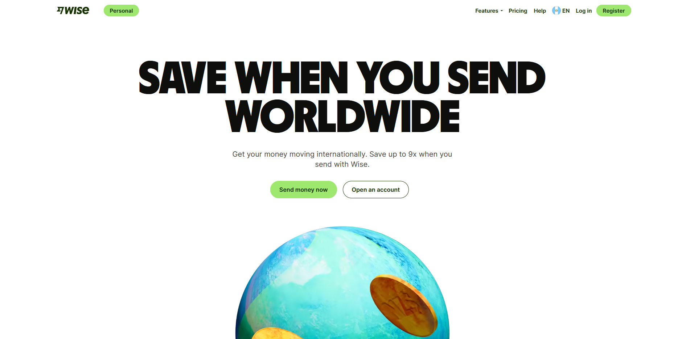

# Replica de Pagina - wise.com

El objetivo de este proyecto era replicar una pagina web con el proposito de aplicar los conceptos aprendidos en la clase de Sistemas y Tecnologías Web. En este proyecto se usaron tecnologías como: React, Babel, Webpack, ESlint y CSS/SCSS.

### Autor:
- Luis García [@luispedro10](https://github.com/luispedro10)

# Pagina de Referencia
#### Wise
[Pagina original :link:](https://wise.com/)

# Como verla? :arrow_right:

La pagina se encuentra subida en firebase en el siguiente link:
    [replica wise :link:](https://luispedro-55850.firebaseapp.com/) 

**O, se puede hacer lo siguiente**

1. Clonar este repositorio 
2. Hacer "npm install react react-dom"
3. Hacer "npm start"

# Herramientas usadas :wrench:
* Sass (v^1.50.1)
* AOS animation
* Webpack (v^5.72.0)
* Babel

> Para mas informacion sobre tecnologias usadas se puede ver: [package.json](/package.json)

# Referencias

- [Pagina principal](https://wise.com/)
- [Webpack](https://webpack.js.org/)
- [ESlint](https://eslint.org/)
- [Sass](https://sass-lang.com/)
- [Babel](https://babeljs.io/)
- [React](https://es.reactjs.org/)
